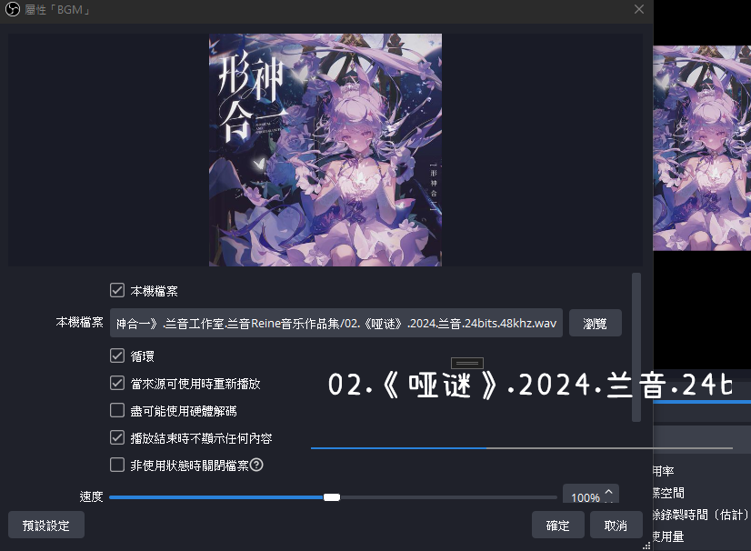
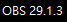
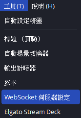
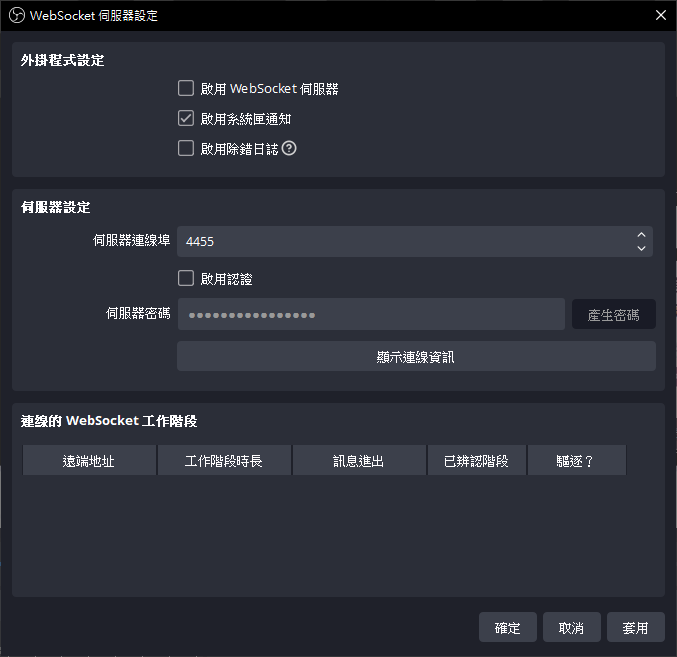
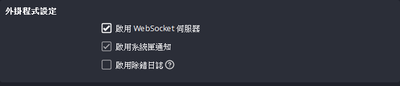
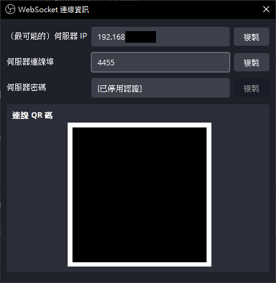
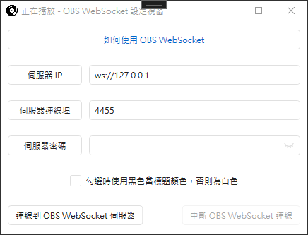
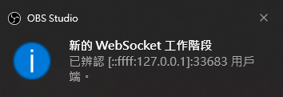

# OBS WebSocket

可以串接 OBS WebSocket Server 來顯示媒體播放狀態

> [!CAUTION]
> 目前為測試版本，且有更改到不少原本程式的邏輯，有問題可發 Issue 或直接向本人詢問

> [!IMPORTANT]
> 由於 WebSocket 資訊獲取問題，目前使用時會將封面圖以及背景設定為透明，讓主播自行設定背景區塊，未來預計會新增透過直接讀取音樂檔案來獲取作者以及封面圖的功能

# 如何使用 OBS WebSocket

1. 先確認 OBS 視窗標題上的版本是否 >= 28，否則需到 [這邊](https://github.com/obsproject/obs-websocket) 下載插件
 

2. 點擊 `工具 > WebSocket 伺服器設定` 開啟設定視窗

3. 點開之後預設的設定應該會是下圖的樣子

4. 勾選 `啟用 WebSocket 伺服器`，並按下套用

5. 點擊 `顯示連線資訊`，會跳出如下的視窗

6. 切換到程式的 `OBS WebSocket 設定視窗`，將連線資訊照樣填到程式內 (基本上是不需要變動，IP 維持 `ws://127.0.0.1` 是可以的，除非 OBS 跟程式在不同的電腦上)

7. 點擊 `連線到 OBS WebSocket 伺服器` 按鈕，若可以正常連線的話 OBS 會跳一個新工作階段通知

8. 軟體會抓取 OBS 全部場景的媒體來源，然後根據來源播放狀態來顯示

> [!NOTE]
> 小黑窗的紀錄類似這樣
>
> 

> [!TIP]
> WebSocket 連線後即可關閉此設定視窗，連線會在背景繼續，直到你手動停止或是關閉程式

# 已知問題
1. 切換場景的時候會有最多 3 秒的反應延遲