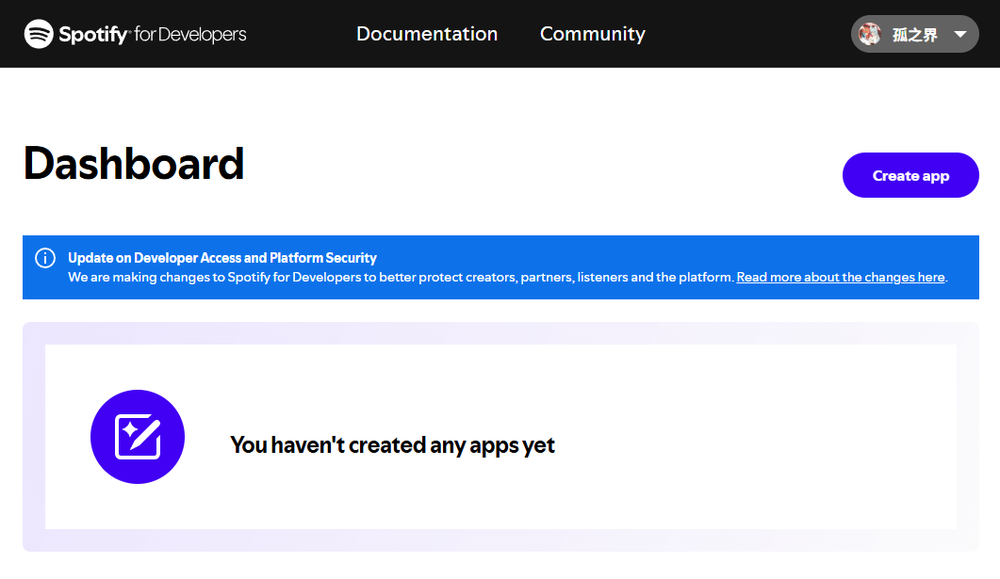
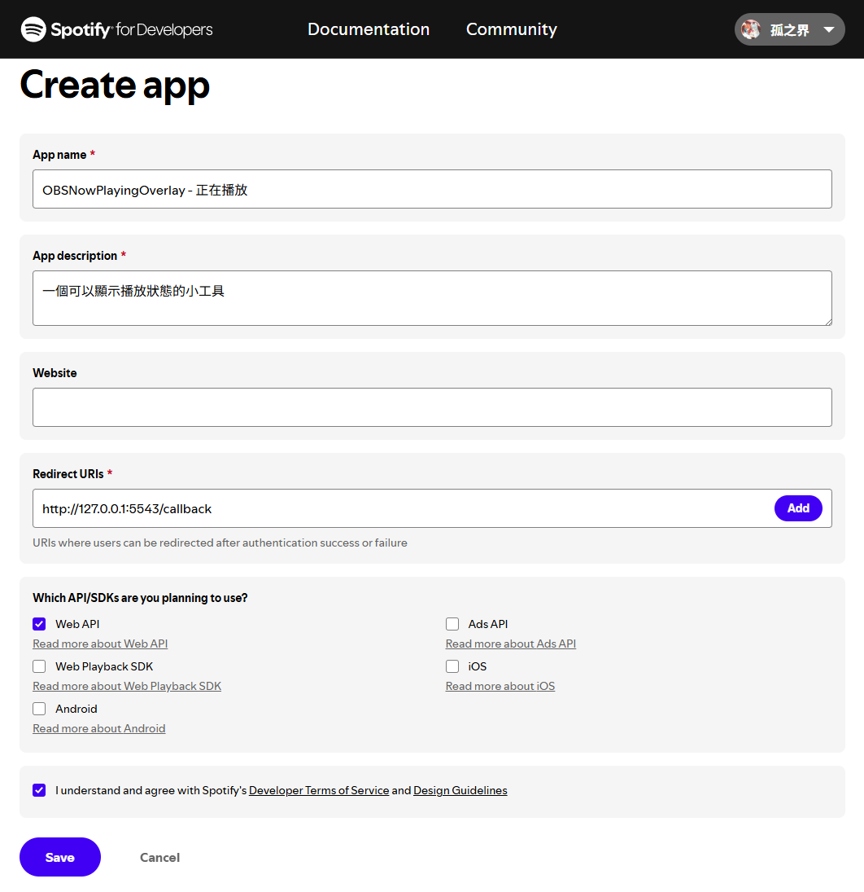
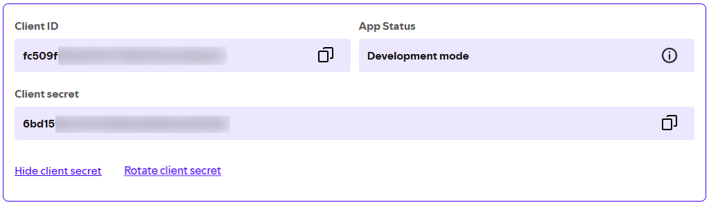
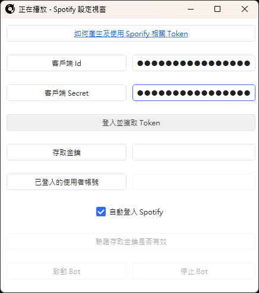
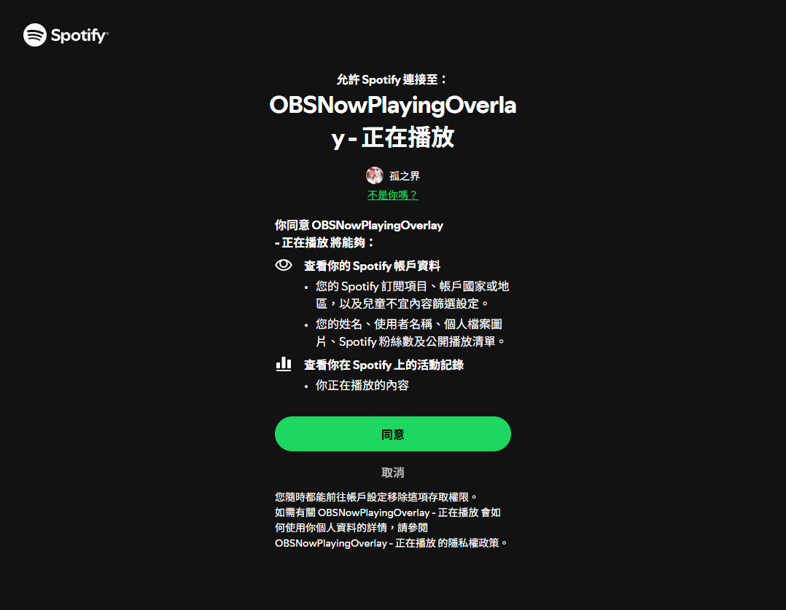
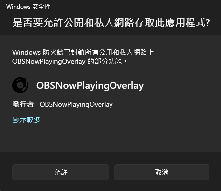
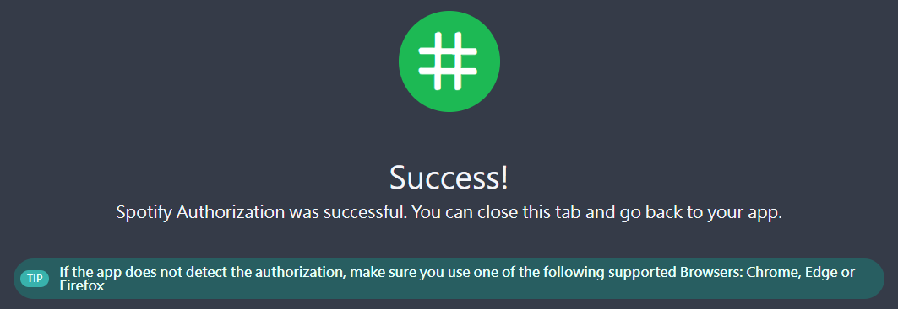
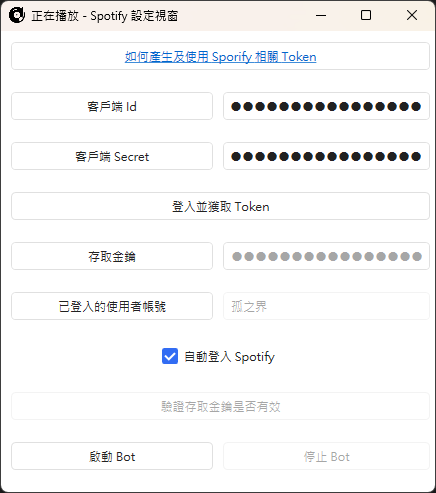
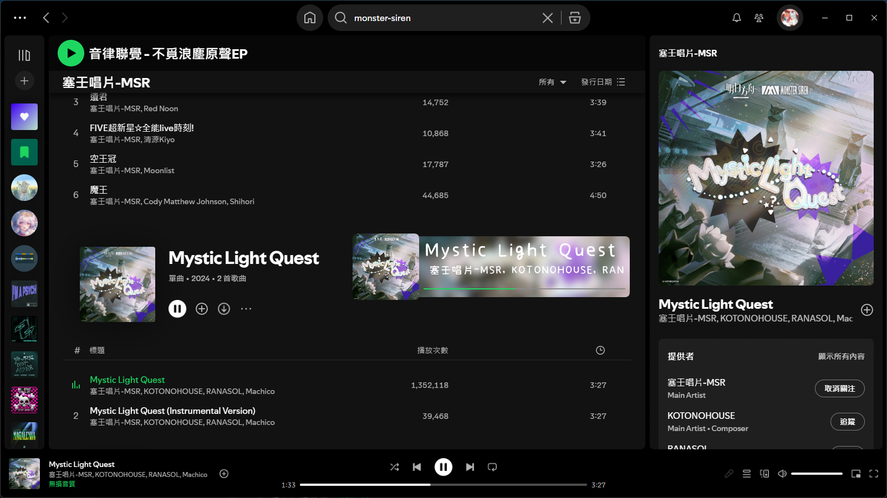

# Spotify API

> [!IMPORTANT]
> 使用 API 的先決條件是你有訂閱 Spotify Premium

# 如何建立並使用 Spotify API

1. 進入 [Spotify Developer Dashboard](https://developer.spotify.com/dashboard) 並點選右上角的 `Create app`

2. 填寫應用程式資訊 (以自己方便辨識為準，唯獨 Redirect URIs 必須為 `http://127.0.0.1:5543/callback`，且下方的 Web API 需打勾)

3. 點選 `View client secret`，並複製 `Client ID` 以及 `Client Secret` (同時確認 App Status 為 `Development mode`)

4. 打開程式，點擊 `Spotify Bot 設定` 開啟設定視窗，並填入 Client ID 跟 Client secret 後點擊 `登入並獲取 Token`

5. 此時會開啟預設瀏覽器並確認 Spotify 連接，確認資訊沒問題後點擊同意

若跳出防火牆通知也直接允許

6. 授權完成後瀏覽器會跳出以下畫面，直接關閉分頁即可

7. 此時程式應該會自動填入 `存取金鑰` 以及 `已登入的使用者名稱`

8. 點擊 `啟動 Bot` 之後程式應該就能正常抓取 Spotify 正在播放的資訊了 

# 登入完成，關閉程式或停止 Bot 後該如何重新啟動 Bot

1. 點擊 `驗證存取金鑰是否有效`
2. 點擊 `啟動 Bot`
3. 若存取金鑰驗證失敗 (取消授權，因超過時間到期)，則會提示要求使用者重新登入，請按照上一章節的步驟重新登入即可

# 已知問題

暫無，也許有部分神奇小 Bug 我沒測到